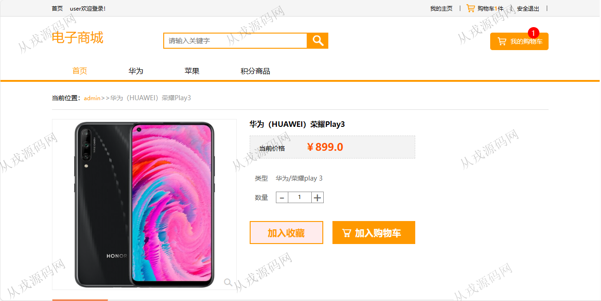
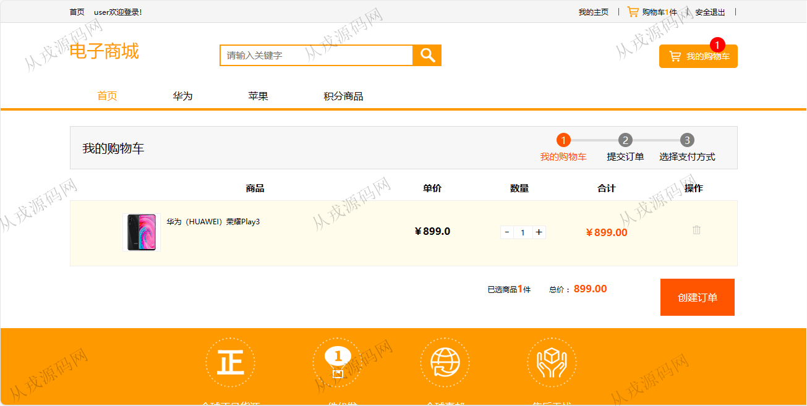
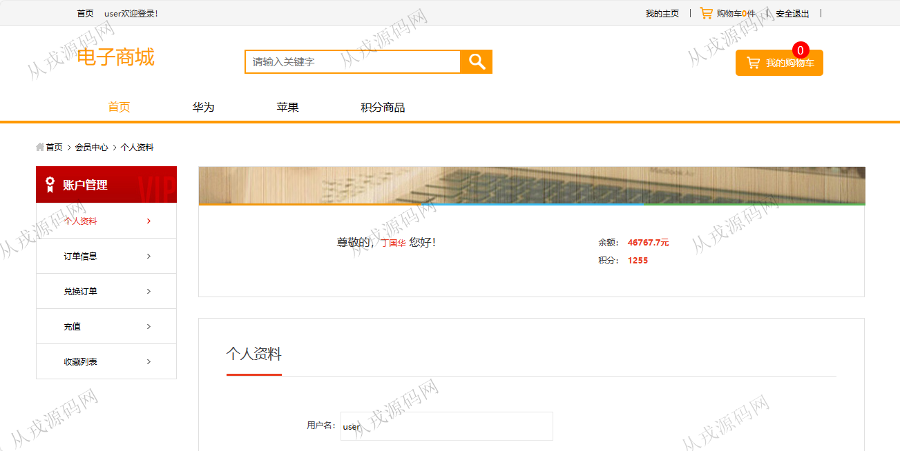
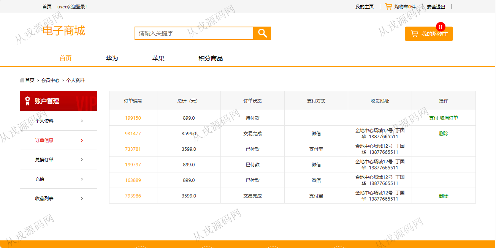
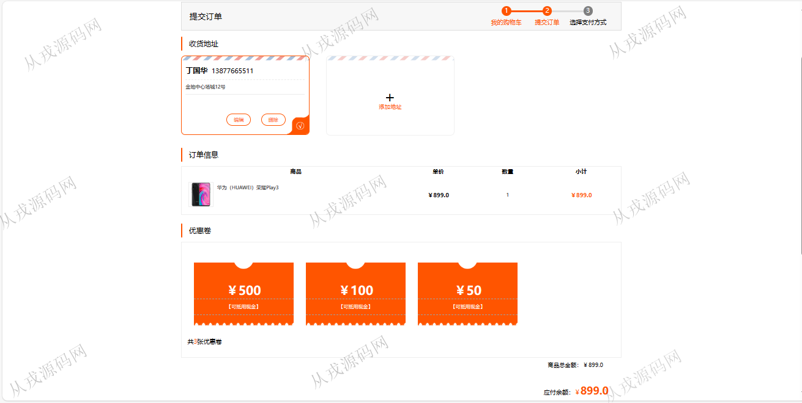
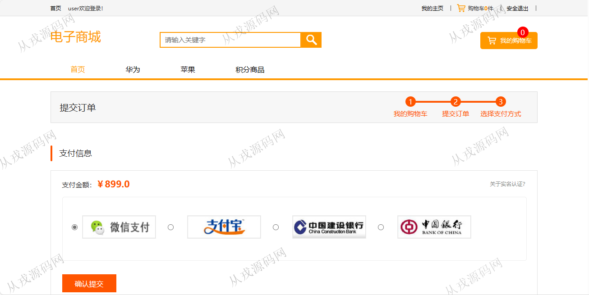
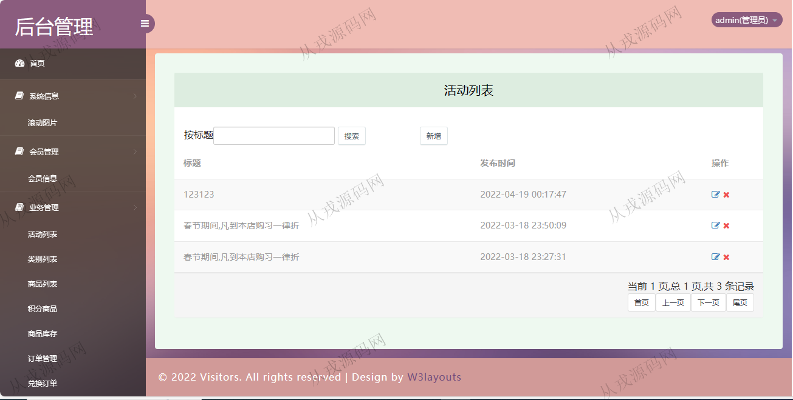

<h1 align="center">182.电子商城管理商城</h1>

 获取sql文件 QQ: 386869957 QQ群: 377586148 

 [更多源码项目: 从戎源码网](https://armycodes.com/) 

## 简介

> 本代码来源于网络,仅供学习参考使用!
>
> 提供1.远程部署/2.修改代码/3.设计文档指导/4.框架代码讲解等服务
> 
> 用户端访问地址：http://localhost:8080/onlineshopssm/index.do
> 
> 用户：user 123456
> 
> 管理后台地址：http://localhost:8080/onlineshopssm/admin/login.jsp
> 
> 管理员：admin 123456
>

## 项目介绍
基于ssm的电子商城管理商城：前端 jsp、jquery，后端 springmvc、spring、mybatis；角色分为管理员，用户；集成电子商品、积分商品、购物车、在线付款、优惠券等功能于一体的系统。

## 功能介绍

### 用户

- 基本功能：登录，注册，退出
- 网站首页：主导航栏，轮播图，全局搜索，最新活动，最新热卖
- 商品：商品列表展示，商品详情，收藏，评论，购物车，填写收货地址，使用优惠券，在线付款
- 我的主页：个人资料查看与修改，余额与积分查询，订单信息查询，兑换订单查询，充值，收藏列表

### 管理员

- 滚动图片：滚动图片列表查询，新增，删除
- 会员管理：会员信息的列表查询，删除，按用户名或姓名模糊搜索，会员信息由用户前台自行注册
- 活动管理：活动信息的增删改查
- 类别管理：类别信息的增删改查，商品大类，品小类，按类别名称模糊搜索
- 商品管理：商品信息的增删改查，商品图片上传，商品介绍支持富文本编辑，查看商品评论，多条件搜索
- 积分商品：积分商品的增删改查
- 订单管理：用户下单后，管理员可以查询用户下单数据，对订单进行发货货删除操作，按订单编号搜索订单信息

## 环境

- <b>IntelliJ IDEA 2021.3</b>

- <b>Mysql 5.7.26</b>

- <b>Tomcat 7.0.73</b>

- <b>JDK 1.8</b>

## 运行截图

